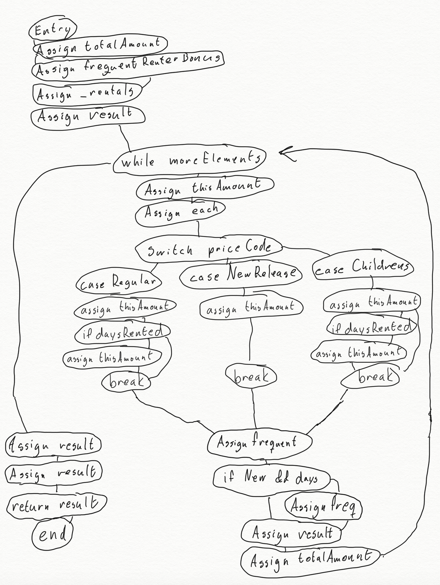
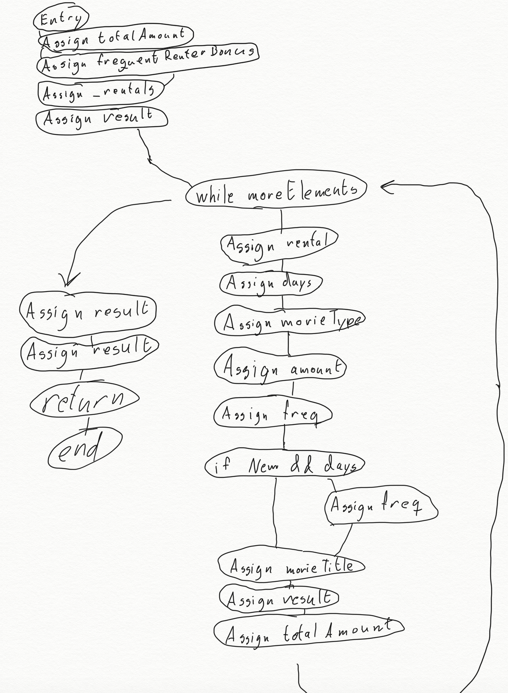

# Obligatory Exercise 1: Refactoring

> DAT159

By Arne Molland and Sondre Gjellestad

## Task 1 | Refactoring Fowler's Video Store

### A. Refactorings

In the original Customer class the statement method looks like this. There is a switch statement that uses a final field on the movie to determine what price should be applied. This can be refactored into a separate abstract class that contains a method that returns the price, depending on the type of the movie. (Replace Conditional with Polymorphism)

We will also extract `each.getDaysRented()` into a variable, as it is called multiple times. (Extract Variable)

```java
switch (each.getMovie().getPriceCode()) {
	case Movie.REGULAR:
		thisAmount += 2;
		if (each.getDaysRented() > 2)
			thisAmount += (each.getDaysRented() - 2) * 1.5;
		break;
	case Movie.NEW_RELEASE:
		thisAmount += each.getDaysRented() * 3;
		break;
	case Movie.CHILDRENS:
		thisAmount += 1.5;
		if (each.getDaysRented() > 3)
			thisAmount += (each.getDaysRented() - 3) * 1.5;
		break;
}
```

After doing the refactoring the Customer#statement method looks like this.

```java
public String statement() {
	double totalAmount = 0;
	int frequentRenterPoints = 0;

	Enumeration<Rental> rentals = this.rentals.elements();

	String result = String.format("Rental Record for %s\n", getName());

	while (rentals.hasMoreElements()) {
		Rental rental = rentals.nextElement();

		int daysRented = rental.getDaysRented();
		MovieType movieType = rental.getMovie().getMovieType();

		// Determine amount for each line
		double amount = movieType.getPrice(daysRented);

		// Add frequent renter points
		frequentRenterPoints++;

		// Add bonus for a two day new release rental
		if ((movieType.getClass() == MovieType.NEW_RELEASE.class) && daysRented > 1) {
			frequentRenterPoints++;
		}

		// Show figures for this rental
		String movieTitle = rental.getMovie().getTitle();
		result += "\t" + movieTitle + "\t" + String.valueOf(amount) + "\n";
		totalAmount += amount;
	}

	// Add footer lines
	result += "Amount owed is " + totalAmount + "\n";
	result += "You earned " + frequentRenterPoints + " frequent renter points";

	return result;
}
```

Here is the new MovieType class.

```java
package io.roger.fowler;

abstract class MovieType {
	abstract double getPrice(int days);

	class REGULAR extends MovieType {
		@Override
		double getPrice(int days) {
			double amount = 2;

			if (days > 2) {
				amount += (days - 2) * 1.5;
			}

			return amount;
		}
	}

	class NEW_RELEASE extends MovieType {
		@Override
		double getPrice(int days) {
			return days * 3;
		}
	}

	class CHILDRENS extends MovieType {
		@Override
		double getPrice(int days) {
			double amount = 1.5;

			if (days > 3) {
				amount += (days - 3) * 1.5;
			}

			return amount;
		}
	}
}

```

In the Movie class, instead of taking a price code parameter, we take an instance of the MovieType class.

```java
public class Movie {
	private String title;
	private MovieType movieType;

	public Movie(String title, MovieType movieType) {
		this.title = title;
		this.movieType = movieType;
	}

	...
}
```

### B. SLOC and cyclomatic complexity

We will now use a couple different metrics to evaluate the effect the refactorings had on our code, specifically on the `Customer#statement`-method.

#### SLOC

After all the refactorings we did, we are now down to this (excluding comments and whitespace).

- SLOC before: 35
- SLOC after: 22

Moving the switch statement out of the method had the biggest effect on this metric.

#### Cyclomatic complexity

We can calculate the cyclomatic complexity using M = E - N + 2P, where E is the number of edges, N is the number of nodes and P is the number of connected components.

- Before: 36 edges - 31 nodes + 2 \* 1 connected components = 17
- After: 21 edges - 20 nodes + 2 \* 1 connected components = 3




Removing the switch statement also had the biggest impact on this metric.

## Task 2 | Self Contained Example Showing the Pull Up Method

Here is some code containing a few classes with inheritance. We have an ancestor Spacecraft class, and a couple types of spacecraft that inherit from it. Looking at the child classes, it might seem that the calculate range function is duplicated, so it might look like an opportunity to lift up the `calculateRange`-method.

```java
public class BeforePullUp {
	static class Spacecraft {
		long MAX_RANGE;

		private long range;

		public long getRange() {
			return this.range;
		}
	}

	static class LunarShuttle extends Spacecraft {
		long MAX_RANGE = 770000l;

		public LunarShuttle(int cargoAmount, int fuelPercentage) {
			range = calculateRange(cargoAmount, fuelPercentage);
		}

		public long calculateRange(int cargoAmount, int fuelPercentage) {
			long range = (MAX_RANGE * fuelPercentage / 100) - (cargoAmount * 150);

			return range >= 0 ? range : 0;
		}
	}

	static class Interstellar extends Spacecraft {
		long MAX_RANGE = 50000000000000l;

		public Interstellar(int cargoAmount, int fuelPercentage) {
			range = calculateRange(cargoAmount, fuelPercentage);
		}

		public long calculateRange(int cargoAmount, int fuelPercentage) {
			long range = (MAX_RANGE * fuelPercentage / 100) - (cargoAmount * 5);

			return range >= 0 ? range : 0;
		}
	}

	public static void main(String[] args) {
		LunarShuttle shuttle = new LunarShuttle(8, 90);
		Interstellar interstellar = new Interstellar(1000, 70);

		System.out.println("The lunar shuttle can travel " + shuttle.getRange() + "km.");
		System.out.println("The interstellar spacecraft can travel " + interstellar.getRange() + "km.");
	}
}
```

After doing the refactoring, our code now looks like this. We pulled up the `calculateRange`-method.

```java
public class AfterPullUp {
	static class Spacecraft {
		long MAX_RANGE;

		long range;

		public long getRange() {
			return this.range;
		}

		public long calculateRange(int cargoAmount, int fuelPercentage) {
			long range = (MAX_RANGE * fuelPercentage / 100) - (cargoAmount * 150);

			return range >= 0 ? range : 0;
		}
	}

	static class LunarShuttle extends Spacecraft {
		long MAX_RANGE = 770000l;

		public LunarShuttle(int cargoAmount, int fuelPercentage) {
			range = calculateRange(cargoAmount, fuelPercentage);
		}
	}

	static class Interstellar extends Spacecraft {
		long MAX_RANGE = 50000000000000l;

		public Interstellar(int cargoAmount, int fuelPercentage) {
			range = calculateRange(cargoAmount, fuelPercentage);
		}
	}

	public static void main(String[] args) {
		LunarShuttle shuttle = new LunarShuttle(8, 90);
		Interstellar interstellar = new Interstellar(1000, 70);

		System.out.println("The lunar shuttle can travel " + shuttle.getRange() + "km.");
		System.out.println("The interstellar spacecraft can travel " + interstellar.getRange() + "km.");
	}
}
```

This is what we get before refactoring, and what we should expect afterwards if the refactoring was appropriate.

```bash
The lunar shuttle can travel 691800km.
The interstellar spacecraft can travel 34999999995000km.
```

However, this is what we actually get. There are a couple things that have gone wrong here. First off, the `MAX_RANGE`-constant now refers to the uninitialized one in the ancestor class and therefore gives zero. We also missed a small difference between the methods, the multipler for `cargoAmount`, which would have made the results different if it wasn't for the first error.

```bash
The lunar shuttle can travel 0km.
The interstellar spacecraft can travel 0km.
```

The conclusion is that one must be careful before pulling up, as a method might depend upon specific things in the child class and there might also be other differences between the methods. In these cases an abstract class/method or interface might be a better option if we wanted to enforce a field with specific types for subclasses.
